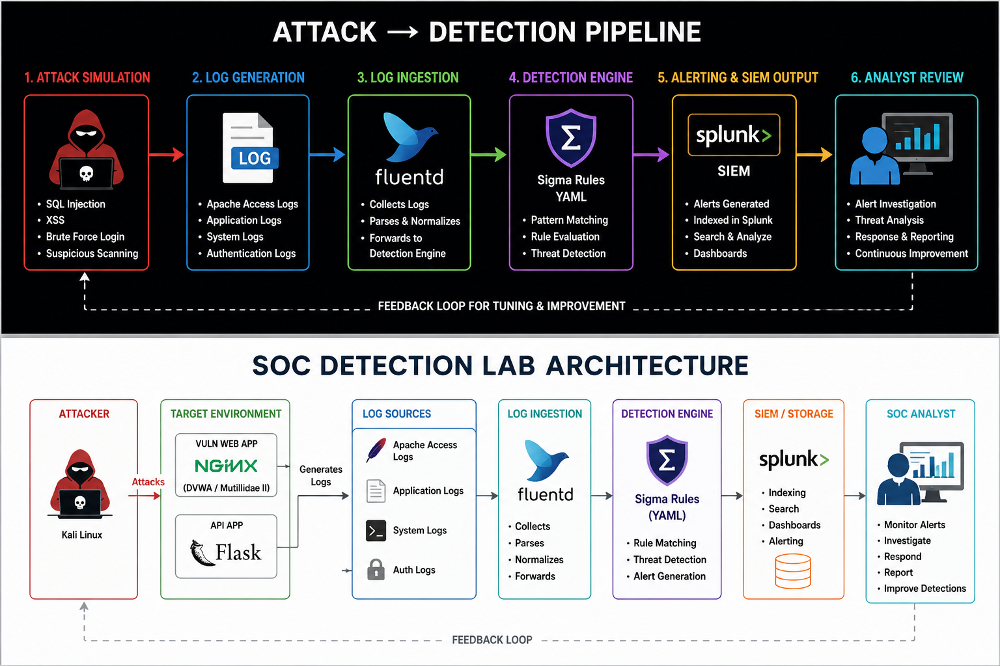
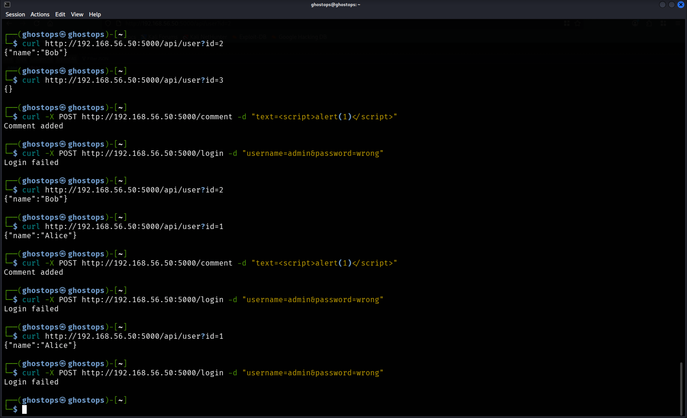
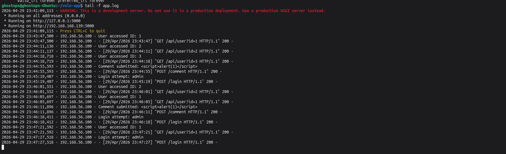
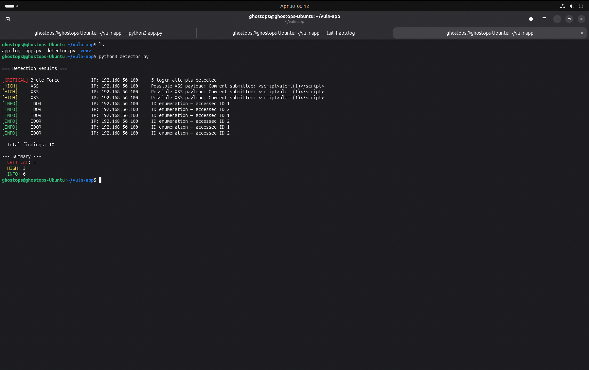
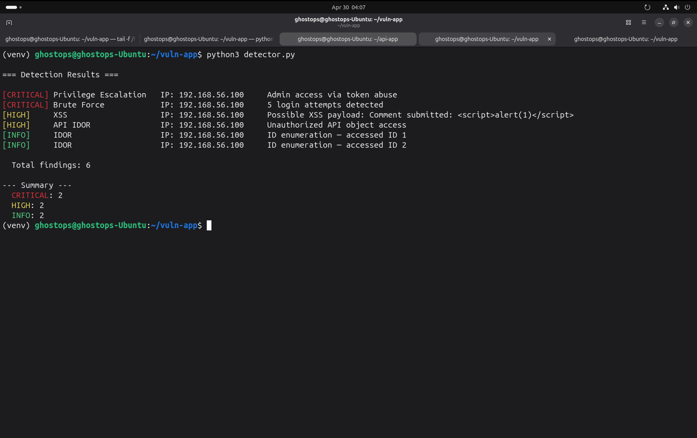
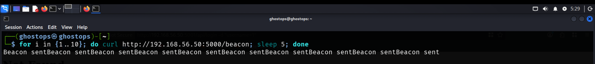
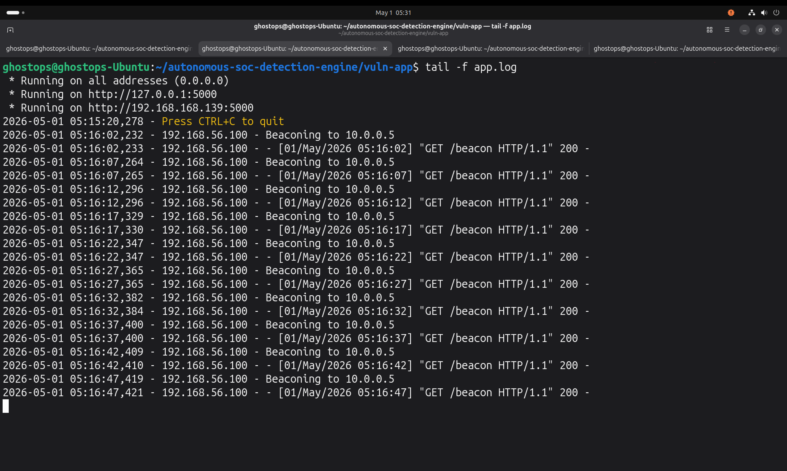
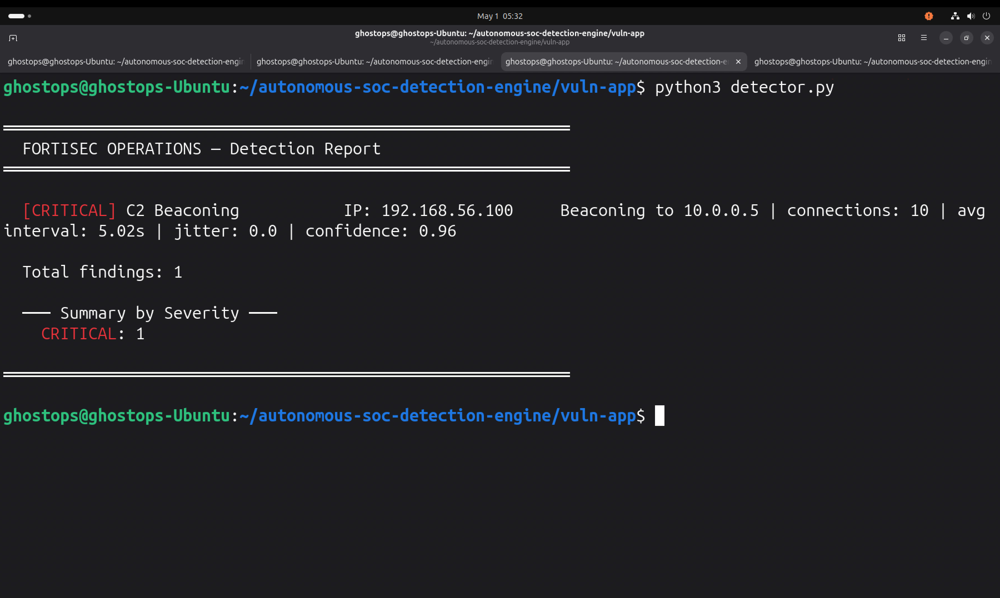

# Autonomous SOC Detection Engine

## Overview

Autonomous DevSecOps-driven SOC detection engine simulating web, API, and C2 beaconing attacks with automated log analysis, behavioral detection, and MITRE ATT&CK-aligned alerting.

---

##  Architecture


The architecture represents a full detection pipeline from attack simulation to SIEM-style alerting.

---

## 🔄 Attack → Detection Pipeline



This pipeline demonstrates how simulated attack traffic is transformed into structured, severity-ranked security alerts.

---

## ⚔️ Attack Simulation



Simulated adversary activity from Kali Linux includes:

- Brute force authentication attempts  
- Stored XSS payload injection  
- IDOR enumeration  
- API authorization abuse  
- Token misuse and privilege escalation  

---

##  Log Generation & Evidence



Application logs capture:

- Source IP attribution  
- Request patterns  
- Payload content  
- Authentication behavior  

These logs act as the primary telemetry source for detection.

---

##  Detection Output (SIEM Simulation)



Structured detection output with severity classification:

- CRITICAL  
- HIGH  
- MEDIUM  
- INFO  

Simulates how alerts would appear in a real SOC environment.

---

## Detection Summary (Analyst View)



Aggregated findings provide an analyst-friendly overview similar to SIEM dashboards.

---

##  C2 Beaconing Detection (Behavioral Analysis)

### ⚔️ C2 Attack Simulation



Simulated beaconing using periodic HTTP requests from an attacker machine (Kali):

```
for i in {1..10}; do curl http://TARGET:5000/beacon
; sleep 5; done
```

---

###  C2 Log Evidence



Observed behavior:

- Repeated connections from same source IP  
- Fixed destination (10.0.0.5)  
- Consistent timing (~5 seconds)  

---

###  C2 Detection Output



Detection engine identifies:

- Low variance communication (jitter ≈ 0)  
- High consistency (machine-like behavior)  
- Confidence scoring (0.96)  

Example alert:

```
[CRITICAL] C2 Beaconing IP: 192.168.56.100
Beaconing to 10.0.0.5 | connections: 10 | avg interval: 5.02s | jitter: 0.0 | confidence: 0.96
```

---

## 🧠 Detection Logic (Simplified)

C2 beaconing is identified by:

1. Grouping traffic by source → destination  
2. Calculating time intervals between requests  
3. Measuring variance (standard deviation)  
4. Detecting low jitter (high regularity)  
5. Assigning confidence based on consistency + frequency  

---

##  Detection Capabilities

- Brute force detection (threshold-based)  
- XSS payload detection  
- IDOR enumeration tracking  
- API authorization abuse detection  
- Privilege escalation detection  
- Token misuse monitoring  
- C2 beaconing detection (behavioral + statistical analysis)  

---

##  MITRE ATT&CK Mapping

| Technique                          | ID     |
|----------------------------------|--------|
| Brute Force                      | T1110  |
| Exploitation of Public-Facing App| T1190  |
| Command and Control (Beaconing)  | T1071  |
| Valid Accounts Abuse             | T1078  |
| Privilege Escalation             | TA0004 |

---

##  Skills Demonstrated

- SOC Alert Triage (L1)  
- Threat Investigation (L2)  
- Detection Engineering  
- Log Correlation  
- Behavioral Threat Analysis  
- DevSecOps Automation  

---

##  Tools & Technologies

- Python (Flask)  
- Linux (Ubuntu / Kali)  
- Custom Detection Engine  
- SIEM Simulation  
- curl / API testing  

---

## 👤 Author

Solomon James  
SOC Analyst | Detection Engineering | DevSecOps


